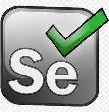

<!--### Hi there 👋, my name is Sandra :portugal:

- :dart: I’m currently working on becoming a global tester
- :book: I’m currently learning API Testing, Selenium, Postman, Jmeter

### :mortar_board:Certification:

_ISTQB® Certified Tester Foundation Level_

### :computer: Courses:

- **Automação 180** - Ruby, Test Environment, Web Automation, API Automation, Capybara, BDD, RSpec, Cucumber, Allure Reports, HTTParty, DevOps, Docker, Jenkins;

- **Comunidade Tester Global** - SDLC, Agile Methodology, TDD, BDD, Testing Technics and Types, Limit Value Analysis, Equivalence Class and Decision Table, Test Pyramid, WEB Systems Architectures, GIT, HTTP Requisitions, APi's, SOAP, REST, Automated API Tests with Java, RestAssured, JUnit 5, Gradle and Intellij, Interface Automated Tests with Selenium;

- **APi Testing** - Postman, Java, RestAssured and Junit 5;

- **Treinamento de Testes de Software para Iniciantes** - Identifying what to Test, Testing in different contexts, Software Architecture and Engineering, Reporting Bugs (Priority vs Severity), Functional Testing (Automated API Testing, Automated Web Testing with Selenium Webdriver), Non Functional Testing (API Testing with Jmeter), SQL;

### :books: Studying

**Descomplicando Testes de API Rest**

### 👩🏻‍💻 Languages and Tools:

:beginner:_Still Learning_:

##### Contact with me:

<!--[][linkedin]

[linkedin]: https://www.linkedin.com/in/sandralourenco/
-->

-->
